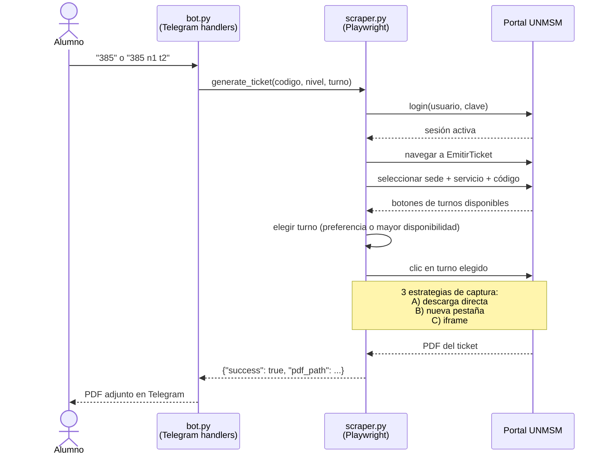

# CucharitaBot

Bot de Telegram que automatiza la emisión de tickets del Comedor Universitario de la UNMSM.

## El problema que resuelve

El sistema de reservas del comedor requiere entrar al portal web, seleccionar sede y servicio, ingresar el código de alumno y elegir turno — varios pasos cada día. Con el bot, el alumno escribe su código en Telegram y recibe el PDF en segundos.

## Stack

| Herramienta | Rol |
|---|---|
| Python 3.11+ | Lenguaje |
| [python-telegram-bot](https://github.com/python-telegram-bot/python-telegram-bot) ≥ 20 | API de Telegram (async) |
| [Playwright](https://playwright.dev/python/) | Automatización de Chromium headless |
| [httpx](https://www.python-httpx.org/) | Descarga del PDF con cookies de sesión |
| python-dotenv | Carga de variables de entorno |

## Instalación

```bash
git clone https://github.com/tu-usuario/CucharitaBot.git
cd CucharitaBot

python -m venv .venv
# Windows:
.venv\Scripts\activate
# Linux/macOS:
# source .venv/bin/activate

pip install -r requirements.txt
playwright install chromium
```

## Variables de entorno

```bash
cp .env.example .env
# Edita .env con tus valores reales
```

| Variable | Descripción | Default |
|---|---|---|
| `TELEGRAM_BOT_TOKEN` | Token del bot (via @BotFather) | requerido |
| `WEB_USER` | Usuario del portal UNMSM | requerido |
| `WEB_PASS` | Contraseña del portal UNMSM | requerido |
| `SEDE_IDX` | Índice de la sede en el select | `1` |
| `SERVICIO_IDX` | Índice del servicio (2 = Almuerzo) | `2` |
| `MAX_CONCURRENT` | Sesiones de navegador simultáneas | `2` |
| `HEADLESS` | `true` = invisible, `false` = debug | `true` |

## Cómo correrlo

```bash
python bot.py
```

## Uso

Escribe en el chat de Telegram:

```
385               → auto-selecciona el turno con más disponibilidad
385 nivel1 turno2 → solicita piso y turno específicos
385 n2 t1         → forma abreviada
```

El bot responde con el PDF del ticket listo para mostrar en el comedor.

## Arquitectura



## Tests

```bash
pytest tests/
```

Los tests cubren el parsing de mensajes y botones (funciones puras, sin red).
